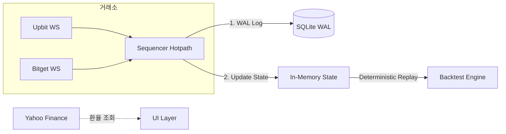

# 🚀 크립토 고 (Crypto Go)

실시간 암호화폐 시세 모니터링 및 결정론적 백테스트를 위한 고성능 **Indie Quant** 엔진입니다.

## 📋 개요 (Overview)

크립토 고는 **단일 스레드 시퀀서(Sequencer)** 아키텍처를 기반으로 설계되었습니다. 모든 금융 데이터는 정밀도 오류를 방지하기 위해 `int64` (Micros) 단위로 처리되며, 모든 입력은 SQLite WAL에 기록되어 100% 재현 가능합니다.

## 🔄 시스템 워크플로우 (Workflow)



## ⚙️ 핵심 설계 원칙 (Indie Quant)

1. **Pragmatic Integrity**: 모든 금액은 `int64` (Micros/Sats)로 처리. 부동소수점(`float64`) 사용 엄격 금지.
2. **Single-Thread Hotpath**: 로직에서 `Mutex`를 제거하고 단일 고루틴에서 이벤트를 순차 처리.
3. **WAL-First**: 상태 반영 전 영속성 계층(SQLite)에 먼저 기록하여 시스템 신뢰성 보장.
4. **Determinism**: "Backtest is Reality." 로그를 리플레이하면 실제 라이브와 100% 동일한 상태 복원.

## 🧪 데이터 모델 (Data Primitives)

- **PriceMicros**: 가격 x 10^6 (1.23 USD = 1,230,000)
- **QtySats**: 수량 x 10^8 (1.0 BTC = 100,000,000)
- **TimeStamp**: Unix Microseconds (int64)

## 🚩 주요 마일스톤 (Milestones)

- **v1.0.0 (Current)**: **Indie Quant Refactoring**. 시퀀서 도입, int64 고정 소수점 연산, SQLite WAL 로깅, 결정론적 리플레이 엔진 구축.
- **v1.0.1 (Legacy)**: 비동기 시세 파이프라인 및 업비트/비트겟 웹소켓 기본 연동.

## 🚀 실행 및 개발 가이드 (Getting Started)

### 1. 전제 조건
- Go 1.25.x 이상

### 2. 설치 및 실행
```bash
# 의존성 설치
go mod tidy

# 애플리케이션 실행
go run cmd/app/main.go
```

### 3. 워크플로우 (Slash Commands)
- `/build`: 바이너리 빌드 (`bin/app.exe`)
- `/run`: 애플리케이션 즉시 실행
- `/test`: 전체 유닛 및 결정론적 리플레이 테스트 실행

## 🛠️ 개발 문서

- [시스템 디자인 (DESIGN.md)](./DESIGN.md): Indie Quant 핵심 설계 철학 및 MVP 기준

---
*본 프로젝트는 Advanced Agentic Coding 실습의 일환으로 고도화되었습니다 (Last Updated: 2026-01-07).*
