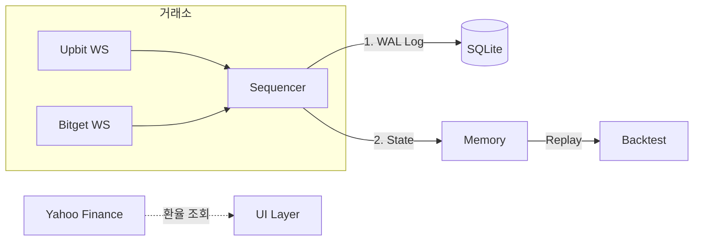

# 🚀 크립토 고 (Crypto Go)

실시간 암호화폐 시세 모니터링 및 결정론적 백테스트를 위한 고성능 **Indie Quant** 엔진입니다.

## 📋 개요 (Overview)

**단일 스레드 시퀀서(Sequencer)** 아키텍처 기반으로, 모든 금융 데이터를 `int64` 고정소수점으로 처리하여 정밀도 오류를 방지합니다. 모든 입력은 SQLite WAL에 기록되어 100% 재현 가능합니다.

## 🔄 시스템 아키텍처



## ⚙️ 핵심 원칙 (Indie Quant)

| 원칙 | 설명 |
|------|------|
| **Pragmatic Integrity** | `int64` (Micros/Sats) 전용. `float64` 금지 |
| **Single-Thread** | 단일 고루틴 Hotpath, Mutex 없음 |
| **WAL-First** | 상태 반영 전 SQLite에 먼저 기록 |
| **Determinism** | 리플레이 = 라이브 100% 동일 |

## 🧪 데이터 타입

| 타입 | 배율 | 예시 |
|------|------|------|
| `PriceMicros` | ×10⁶ | 1.23 USD = 1,230,000 |
| `QtySats` | ×10⁸ | 1.0 BTC = 100,000,000 |
| `TimeStamp` | - | Unix Microseconds |

## � 시작하기

```bash
# 의존성 설치
go mod tidy

# 실행
go run cmd/app/main.go

# 테스트
go test -v ./...
```

### 워크플로우
- `/build`: 바이너리 빌드
- `/run`: 애플리케이션 실행
- `/test`: 전체 테스트 (Fuzz 포함)

## 📁 프로젝트 구조

```
pkg/
├── quant/     # 고정소수점 타입 (PriceMicros, QtySats)
└── safe/      # SafeMath (Panic on Overflow)

internal/
├── engine/    # Sequencer (단일 스레드 이벤트 처리)
├── event/     # Event 정의 및 Pool
├── domain/    # 도메인 객체 (Ticker, Balance, Alert)
├── storage/   # SQLite WAL 저장소
└── infra/     # 외부 연동 (Upbit, Bitget, Yahoo)

backtest/      # 결정론적 리플레이 엔진
```

## � 문서

- [DESIGN.md](./DESIGN.md): Indie Quant 설계 원칙

---
*Last Updated: 2026-01-07*
