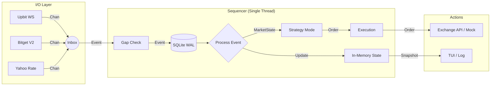

# 🚀 CryptoGo: Quant Framework

**CryptoGo**는 초고속 의사결정과 완벽한 검증(Backtest is Reality)을 목표로 하는 **Go 언어 기반의 결정론적(Deterministic) 퀀트 트레이딩 프레임워크**입니다.

> **Current Status**: MVP Phase 1 (Monitoring Implemented / Trading Skeleton Ready)

---

## 🎯 MVP Scope

### 1. Monitoring First (✅ Implemented)
*   **Data Aggregation**: Upbit(KRW), Bitget(USDT), Yahoo Finance(USD/KRW) 데이터를 실시간 통합.
*   **Zero-Risk**: 매매 로직 없이 시장을 완벽하게 관찰하는 것을 최우선 목표로 함.
*   **Infrastructure**:
    *   **Bitget**: Spot & Futures 모두 최신 **V2 API** 적용 (`USDT-FUTURES`).
    *   **Exchange Rate**: Yahoo Finance를 통한 안정적 환율 수신.

### 2. Trading Skeleton (✅ Ready)
*   **Architecture**: 매매 로직을 담을 그릇(Interface)과 데이터 구조(Entity) 완성.
*   **Mock Execution**: 실제 주문 전송 없이 로직을 검증할 수 있는 안전 장치.

---

## 🏛️ 아키텍처 (Architecture)

모든 데이터 흐름은 **Sequencer**라고 불리는 단일 파이프라인(Hotpath)을 통과합니다.



### 핵심 원칙
1.  **Single Threaded**: 모든 상태 변경은 단일 고루틴에서 순차 처리 (No Mutex, No Deadlock).
2.  **Int64 Only**: 돈과 수량은 오직 `int64` (Micros/Sats)만 사용. `float` 사용 시 빌드 경고.
3.  **Fail Fast**: 오버플로우나 데이터 유실 감지 시 즉시 시스템 중단 (Panic).

---

## 🛠️ 모듈별 상세 (Modules)

### 1. `internal/domain` (Entities)
*   **`Order` / `Position`**: 매매의 핵심 객체. 엄격한 타입 정의 (`PriceMicros`, `QtySats`).
*   **`MarketState`**: 통합된 시장 상황 (현재가, 호가 등).

### 2. `internal/infra` (Gateways)
*   `upbit`: 업비트 웹소켓 (KRW 마켓).
*   `bitget`: 비트겟 V2 API (Spot / Futures `USDT-FUTURES`).
*   `exchange_rate`: Yahoo Finance 환율 정보.
*   **Common**: 지수 백오프(Exponential Backoff) 표준 적용.

### 3. `internal/strategy` (Logic)
*   **Interface**: `OnMarketUpdate(State) -> []Order`
*   **Reference**: `SMACrossStrategy` (Ring Buffer 최적화, Zero-Alloc).

### 4. `internal/execution` (Action)
*   **Interface**: `SubmitOrder`, `CancelOrder`.
*   **MockExecution**: MVP 단계에서의 안전한 테스트 실행기.
*   **PaperExecution**: 가상 잔고로 전략 검증.

### 5. `internal/infra` (Advanced)
*   **Circuit Breaker**: 외부 API 장애 자동 격리.
*   **Metrics**: Atomic Counter 기반 경량 모니터링.

### 6. `internal/storage` (Persistence)
*   **WAL**: 이벤트 로깅 및 복구.
*   **Snapshot**: 빠른 상태 복원.

---

## 🚀 시작하기 (Getting Started)

### 요구 사항
*   Go 1.21 이상

### 실행 및 테스트
```bash
# 1. 의존성 설치
go mod tidy

# 2. 유닛 테스트 (전체 검증)
go test -v -race ./...

# 3. 실행 (향후 메인 루프 구현 예정)
go run cmd/app/main.go
```

---

*Created by Indie Quant Team based on Deterministic Architecture.*
