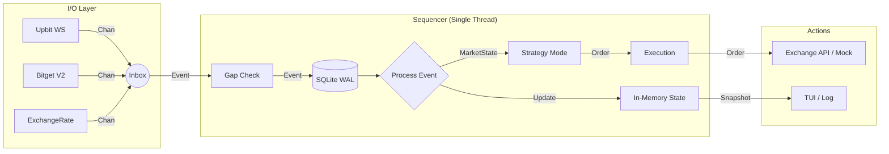

# 🚀 CryptoGo: Quant Framework


**CryptoGo**는 초고속 의사결정과 완벽한 검증(Backtest is Reality)을 목표로 하는 **Go 언어 기반의 결정론적(Deterministic) 퀀트 트레이딩 프레임워크**입니다.

> **Current Status**: MVP Phase 1 (Monitoring Implemented / Trading Skeleton Ready)

---

## 🎯 MVP Scope

### 1. Monitoring First (✅ Implemented)
*   **Data Aggregation**: Upbit(KRW), Bitget(USDT), Exchange Rate(USD/KRW) 데이터를 실시간 통합.
*   **Zero-Risk**: 매매 로직 없이 시장을 완벽하게 관찰하는 것을 최우선 목표로 함.
*   **Infrastructure**:
    *   **Bitget**: Spot & Futures 모두 최신 **V2 API** 적용 (`USDT-FUTURES`).
    *   **Exchange Rate**: Yahoo Finance API를 통한 안정적 환율 수신.

### 2. Core Trading Skeleton (✅ Advanced Maturity)
*   **Domain-Driven Architecture**: 핵심 비즈니스 로직(`domain`, `execution`, `order`, `balance`) 통합 및 인터페이스 계층의 클린 아키텍처화 완료.
*   **Lifecycle Control**: 핫패스(`Sequencer`) 메시지 큐의 우아한 종료(Graceful Shutdown) 및 무중단 동시성 처리 안전성 확보.
*   **Mock Execution**: 실제 주문 전송 없이 전략 로직 자체만을 검증할 수 있는 100% 안전 장벽.
*   **Paper Execution**: 3대 불변식(자산 음수 불가 등)을 포함한 가상 잔고(`BalanceBook`) 기반의 정밀한 PnL 시뮬레이션. 
*   **Dependency Injection**: 상황에 맞는 모드 스위칭(`Execution Factory: PAPER/DEMO/REAL`) 및 E2E 테스트를 위한 외부 API 타겟팅(Mock WebSockets) 오버라이딩 완벽 지원.

---

## 🏛️ 아키텍처 (Architecture)

모든 데이터 흐름은 **Sequencer**라고 불리는 단일 파이프라인(Hotpath)을 통과합니다.


```mermaid
graph LR
    subgraph Inputs ["I/O Layer"]
        UB[Upbit WS] -->|Chan| Inbox
        BG[Bitget V2] -->|Chan| Inbox
        FX[ExchangeRate] -->|Chan| Inbox
    end

    subgraph Core ["Sequencer (Single Thread)"]
        Inbox((Inbox)) -->|Event| Check[Gap Check]
        Check -->|Event| WAL[(SQLite WAL)]
        WAL --> Logic{Process Event}
        Logic -->|MarketState| Strategy[Strategy Mode]
        Strategy -->|Order| Exec[Execution]
        Logic -->|Update| State[In-Memory State]
    end

    subgraph Output ["Actions"]
        Exec -->|Order| API[Exchange API / Mock]
        State -->|Snapshot| UI[TUI / Log]
    end
```

### 핵심 원칙
1.  **Single Threaded**: 모든 상태 변경은 단일 고루틴에서 순차 처리 (No Mutex, No Deadlock).
2.  **Int64 Only**: 돈과 수량은 오직 `int64` (Micros/Sats)만 사용. Hotpath 내 `float` 사용 금지.
3.  **Fail Fast**: 오버플로우나 데이터 유실 감지 시 즉시 시스템 중단 (Panic).
4.  **WAL-First**: 이벤트는 처리 전 반드시 SQLite에 저장 (크래시 복구 보장).
5.  **Zero-Alloc**: Hotpath 내 힙 할당 0 B/op (`sync.Pool`, Ring Buffer, 사전 할당 배열).
6.  **Determinism**: WAL 재생(Replay) = 동일 입력 → 동일 상태 (백테스트 = 라이브).

---

## 📐 프로젝트 구조 (Structure)

```
cryptoGo/
├── cmd/                          # 진입점
│   ├── app/main.go              # 메인 애플리케이션
│   ├── e2e/engine_test.go       # E2E 통합 테스트 스위트
│   ├── integration/main.go      # 외부 API 통합 테스트
│   └── pricetest/main.go        # 가격 테스트 실행기
├── internal/                     # 핵심 비즈니스 로직
│   ├── app/                     # 부트스트랩 (초기화 시퀀스)
│   ├── domain/                  # 엔티티 (Order, Balance, Position, Ticker 등)
│   ├── engine/                  # Sequencer (단일 스레드 핫패스)
│   ├── event/                   # 이벤트 시스템 + sync.Pool
│   ├── execution/               # 주문 실행 (Mock / Paper / Real)
│   ├── infra/                   # 인프라 (WS, Circuit Breaker, Metrics 등)
│   │   ├── bitget/             # Bitget V2 어댑터 (Spot + Futures)
│   │   └── upbit/              # Upbit 웹소켓 어댑터
│   ├── storage/                 # 영속성 (SQLite WAL + Snapshot)
│   └── strategy/                # 전략 로직 (SMA Cross 등)
├── pkg/                         # 공용 라이브러리
│   ├── safe/                    # SafeMath (오버플로우 방어)
│   └── quant/                   # 퀀트 타입 (PriceMicros, QtySats)
├── backtest/                    # 백테스트 엔진 (WAL Replayer)
├── configs/config.yaml          # 설정 템플릿 (공개용)
├── docs/                        # 문서
│   ├── adr/                    # Architecture Decision Records
│   └── WALKTHROUGH.md          # 전체 코드 분석 문서
├── scripts/                     # 관리 스크립트 (Git Hooks 등)
└── _workspace/                  # [IGNORED] 로컬 실행 환경 (민감 데이터 격리)
    ├── secrets/                # API Key (demo.yaml, real.yaml)
    ├── data/{mode}/            # SQLite DB (events.db)
    └── logs/                   # 애플리케이션 로그 (with rotation)
```

---

## 🛠️ 모듈별 상세 (Modules)

### 1. `internal/domain` — 핵심 엔티티
*   **`Order` / `Position`**: 매매의 핵심 객체. 엄격한 타입 정의 (`PriceMicros`, `QtySats`).
*   **`MarketState`**: 통합된 시장 상태 (캐시라인 최적화: Hot Field 전방 배치).
*   **`Balance` / `BalanceBook`**: 3대 불변식 강제 — `Amount ≥ 0`, `Reserved ≥ 0`, `Reserved ≤ Amount`.
*   **`Ticker` / `MarketData`**: 거래소별 시세 통합, 김프(Premium) 계산, 선물/현물 Gap 산출.
*   **`AlertConfig`**: 가격 알림 (방향 자동 판단: UP/DOWN).

### 2. `internal/engine` — Sequencer
*   **Single-Thread Loop**: `for { select { case ev := <-inbox: processEvent(ev) } }`
*   **WAL-First**: 이벤트 처리 전 SQLite에 선행 저장.
*   **Gap Detection**: seq gap ≤ 10 허용(경고), gap > 10 즉시 `panic`.
*   **Strategy Dispatch**: `OnMarketUpdate()` → 사전 할당 버퍼(`[16]Order`)에 시그널 기록.
*   **State Dump**: 패닉 시 `panic_dump.json`으로 전체 상태 직렬화.

### 3. `internal/infra` — 인프라 게이트웨이
*   **`BaseWSWorker`**: 범용 WebSocket 관리자 (자동 재연결 + 지수 백오프).
*   **`upbit/`**: 업비트 웹소켓 (KRW 마켓). `json.Number`로 float 회피.
*   **`bitget/`**: 비트겟 V2 API (Spot / Futures `USDT-FUTURES`). HMAC-SHA256 서명.
*   **`exchange_rate`**: Yahoo Finance USD/KRW 환율 (HTTP 폴링 60초 간격).
*   **`CircuitBreaker`**: 3-State (Closed/Open/HalfOpen), 5회 실패 → 30초 차단.
*   **`RateLimiter`**: Token Bucket (주문: 10/s burst 5, 시장: 20/s burst 10).
*   **`Metrics`**: Atomic Counter 기반 경량 모니터링 (이벤트/에러/레이턴시).

### 4. `internal/strategy` — 전략 로직
*   **Interface**: `OnMarketUpdate(state, outBuf) -> int` (Zero-Alloc).
*   **Reference**: `SMACrossStrategy` (Ring Buffer 최적화, Sum 캐싱, ~16ns/op).
*   Golden Cross → BUY, Dead Cross → SELL.

### 5. `internal/execution` — 주문 실행
*   **`MockExecution`**: 로그만 출력 (개발/테스트용).
*   **`PaperExecution`**: 가상 잔고로 전략 검증 (Fill 기록, PnL 추적).
*   **`RealExecution`**: Bitget V2 REST API로 실제(또는 데모) 주문 전송.
*   **`ExecutionFactory`**: 설정 기반 모드 전환 (PAPER / DEMO / REAL).

### 6. `internal/storage` — 영속성
*   **`EventStore`**: SQLite WAL 모드 이벤트 저장소 + 메타데이터 KV 스토어.
*   **`SnapshotManager`**: JSON 기반 스냅샷 저장/복원/정리 (WAL 전체 재생 불필요).

### 7. `pkg/safe` — SafeMath
*   `SafeAdd`, `SafeSub`, `SafeMul`, `SafeDiv` — 오버플로우/0 나눗셈 시 `panic`.
*   Fuzz 테스트 포함.

### 8. `pkg/quant` — 퀀트 타입
*   `PriceMicros` (int64, ×10⁶) / `QtySats` (int64, ×10⁸) / `TimeStamp` (Unix μs).
*   `parseFixedPoint()`: 문자열→int64 직접 변환 (float 미사용).

### 9. `backtest/` — 백테스트 엔진
*   SQLite에서 이벤트 순차 로드 → `Sequencer.ReplayEvent()` 동기 호출.
*   라이브와 **100% 동일한 코드 패스** 사용 (결정론적 재현).

---

## 🔐 보안 모델 (Security)

| 계층 | 매커니즘 |
|------|----------|
| **키 저장** | `[]byte` 저장 + `Wipe()` 메서드 (종료 시 메모리 소거) |
| **비밀 격리** | `_workspace/secrets/` → `.gitignore`로 유출 차단 |
| **환경변수 주입** | `CRYPTO_BITGET_KEY`, `CRYPTO_UPBIT_KEY` 등 (설정 파일보다 우선) |
| **실전 매매 방지** | `CONFIRM_REAL_MONEY=true` Safety Latch (미설정 시 panic) |
| **인스턴스 락** | `instance.lock` 파일로 DB 동시 접근 방지 |
| **Rate Limiting** | Token Bucket으로 API IP 차단 방지 |
| **Circuit Breaker** | 외부 API 장애 자동 격리 |

---

## 🛡️ E2E 통합 안전장치 (Automated Guardrails)

본 시스템은 단순 유닛 테스트를 넘어, **실제 운영(Production) 환경과 100% 동일한 통합 테스트(E2E)**를 내장하고 있습니다 (`cmd/e2e/engine_test.go`).
이 테스트 스위트는 외부 의존성(네트워크, 실제 API 키) 없이 **로컬 가짜(Mock) 웹소켓 서버**를 0.1초 만에 띄워 다음을 완벽하게 검증합니다.

1. **자동화된 배포 안전장치 (CI/CD)**: 코드를 병합하기 전에 `데이터 수신 → 엔진 처리 → WAL DB 저장`의 전체 파이프라인 무결성을 보장합니다.
2. **Cold-Start 및 복구(Recovery) 100% 검증**: 시스템이 크래시되거나 재시작되었을 때, 기존 WAL 데이터를 완벽하게 소화하고 중복 오류(Panic) 없이 매매를 재개하는지 수학적으로 증명합니다.
3. **새로운 거래소 연동 샌드박스**: 실자본의 위협 없이 바이낸스(Binance) 등 새로운 웹소켓 포맷이 파이프라인에서 뻗지 않는지 안전하게 시뮬레이션 할 수 있습니다.

---

## 📊 성능 지표 (Performance)

| 지표 | 목표 | 달성 |
|------|------|------|
| **Hotpath Latency** | < 1ms (p99) | ~5-15ns/op |
| **Heap Allocation** | Zero-Alloc | 0 B/op (sync.Pool + Ring Buffer) |
| **SMA Strategy** | < 100ns | ~16ns/op |
| **Event Warmup** | 부팅 시 GC Pause 방지 | 1,000개 사전 할당 |

---

## 🚀 시작하기 (Getting Started)

### 요구 사항
*   Go 1.25 이상

### 가동 준비 (Setup)
1.  `_workspace/secrets/` 폴더가 없다면 생성합니다.
2.  API 키가 필요한 경우 `_workspace/secrets/demo.yaml` 또는 환경변수로 설정합니다.
3.  설정 파일은 `configs/config.yaml`에서 관리합니다.

### 실행 및 테스트
```bash
# 1. 의존성 설치
go mod tidy

# 2. 유닛 테스트 (전체 구조 검증)
go test -v -race ./internal/... ./pkg/...

# 3. E2E 통합 테스트 (Mock 거래소 & 엔진 라이프사이클 검증)
go test -v ./cmd/e2e

# 4. 벤치마크 실행 (Zero-Alloc & Hotpath 성능)
go test -bench=. -benchmem ./internal/engine/ ./internal/strategy/

# 5. 실행
go run cmd/app/main.go
```

### 리눅스 빌드 및 실행
```bash
# 네이티브 빌드
go build -o crypto-go ./cmd/app/main.go

# 실행
chmod +x crypto-go
./crypto-go
```

> [!NOTE]
> 데스크탑 사용자의 경우, 터미널에서 실행하면 실시간 로그와 명령 프롬프트를 통해 즉각적인 피드백을 확인할 수 있습니다.

> [!TIP]
> 우리 프로젝트는 **Pure Go SQLite** 드라이버를 사용하므로, 리눅스 환경에 추가적인 라이브러리(CGO 관련)를 설치할 필요가 전혀 없습니다.

### 실행 모드

| 모드 | 설명 | 활성화 |
|------|------|--------|
| **PAPER** | 내부 시뮬레이션 (기본값) | `trading.mode: "PAPER"` |
| **DEMO** | Bitget 테스트넷 연동 | `trading.mode: "DEMO"` + `secrets/demo.yaml` |
| **REAL** | 실전 매매 | `trading.mode: "REAL"` + `CONFIRM_REAL_MONEY=true` |

---

## 📖 문서 (Documentation)

*   **[DESIGN.md](DESIGN.md)**: 아키텍처 설계 철학 및 구현 디테일
*   **[docs/WALKTHROUGH.md](docs/WALKTHROUGH.md)**: 전체 코드베이스 종합 분석 (79개 파일)
*   **[docs/adr/](docs/adr/)**: Architecture Decision Records (6건)

---

*Created by Quant Team based on Deterministic Architecture.*