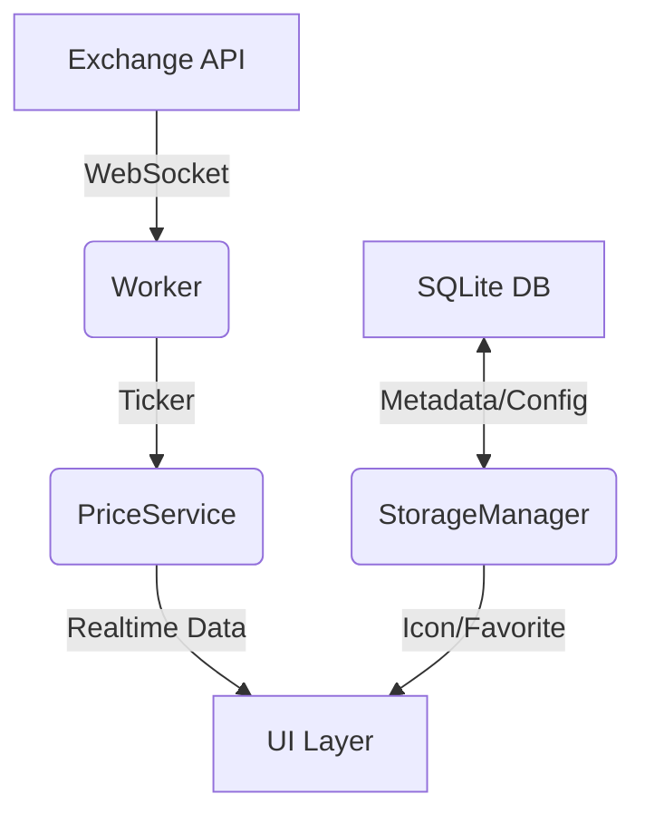

# Crypto Go 기술 명세서 (Technical Specifications)

**작성일**: 2026년 1월 7일
**버전**: 2.0 (Backend & Data Layer)
**상태**: Draft

## 1. 시스템 아키텍처 (System Architecture)

Crypto Go는 **고성능 백엔드 엔진(Backend Engine)**과 **사용자 중심의 UI 레이어**로 구성됩니다. 현재 백엔드 엔진은 상용 수준의 안정성을 확보했습니다.

### 1.1 Core Components
*   **PriceService**: 실시간 시세 데이터 중앙 관리 (Memory In-Memory DB 역할).
*   **Exchange Workers**: Upbit, Bitget(Spot/Futures) 웹소켓 연결 및 데이터 수집.
*   **Storage Layer (New)**: SQLite 및 로컬 파일 시스템을 통한 영구 저장소.

### 1.2 Data Flow

---

## 2. 데이터 영속성 설계 (Persistence Layer)

데이터 무결성과 빠른 로딩을 위해 **하이브리드 저장 방식**을 사용합니다.
상세 내용은 [DATA_ARCHITECTURE.md](./antigravity/brain/47f3be7a-da03-4c41-882c-a6e283c726d9/DATA_ARCHITECTURE.md)를 따릅니다.

### 2.1 저장소 위치 (Windows)
*   **DB**: `%LocalAppData%\CryptoGo\data\cryptogo.db`
*   **Assets**: `%LocalAppData%\CryptoGo\assets\icons\`
*   **Config**: `%LocalAppData%\CryptoGo\config.yaml`

### 2.2 주요 엔티티 (Schema)
*   **CoinInfo**: `symbol(PK)`, `name`, `icon_path`, `is_active`, `is_favorite`, `last_synced_at`
*   **AppConfig**: `key(PK)`, `value`

---

## 3. 부팅 및 동기화 프로세스 (Startup Sequence)

앱 실행 시(Splash Screen) 백그라운드에서 수행되는 로직입니다.

### Phase 1: 초기화 (Bootstrapping)
1.  **Config Load**: `config.yaml` 로드 및 유효성 검사.
2.  **DB Check**: SQLite 파일 존재 여부 확인 및 Auto Migration.
3.  **Dir Check**: `assets/icons` 등 필수 디렉토리 생성.

### Phase 2: 자산 동기화 (Asset Sync)
1.  **Symbol Sync**:
    *   거래소 API로 최신 심볼 목록 Fetch.
    *   DB와 대조하여 `New`(추가), `Delisted`(비활성), `Re-listed`(재활성) 처리.
2.  **Icon Sync**:
    *   `is_active=true`이고 `icon_path`가 없거나 오래된 경우 다운로드 큐에 추가.
    *   병렬(Groutines)로 아이콘 다운로드 및 저장.
    *   **Progress Report**: UI에 "Syncing... (5/100)" 진행률 전달.

---

## 4. UI 연동 인터페이스 (API Interface)

UI 레이어(TUI/GUI)가 백엔드와 통신하기 위한 메서드 명세입니다.

### 4.1 Data Access
*   `GetMarketData() -> []MarketData`: 모든 코인의 현재가, 김프 등 리턴(Top-level view).
*   `GetCoinMeta(symbol) -> CoinInfo`: 특정 코인의 아이콘 경로, 즐겨찾기 상태 리턴.
*   `ToggleFavorite(symbol)`: 즐겨찾기 상태 토글 및 DB 즉시 반영.

### 4.2 System Control
*   `UpdateConfig(key, value)`: 설정 변경(DB 반영).
*   `Shutdown()`: 모든 워커 종료 및 리소스 정리.

---

## 5. 향후 확장성 (Scalability)
*   **Backtesting**: SQLite에 저장된 과거 틱 데이터를 활용한 전략 검증 기능.
*   **Trading Bot**: `OrderManager` 모듈 추가 시 자동 매매 가능.
