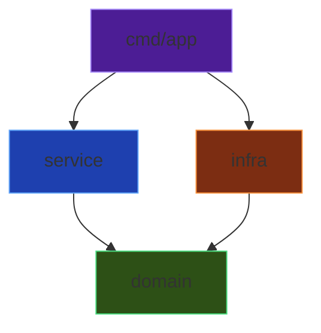
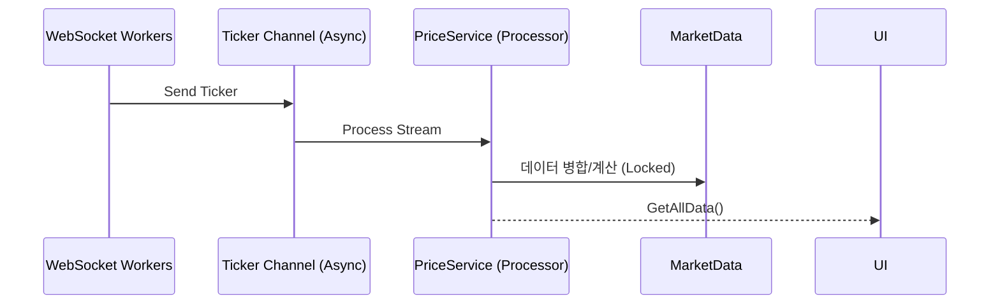

# 크립토 고 (Crypto Go) 아키텍처

## 레이어 구조

```
┌─────────────────────────────────────────────────┐
│                    cmd/app                      │
│               (진입점, DI, 생명주기)              │
├─────────────────────────────────────────────────┤
│                    service                      │
│          (비즈니스 로직, 상태 관리)               │
├─────────────────────────────────────────────────┤
│                    domain                       │
│         (엔티티, 인터페이스, 순수 로직)            │
├─────────────────────────────────────────────────┤
│                     infra                       │
│        (외부 API, WebSocket, 설정 로드)          │
└─────────────────────────────────────────────────┘
```

## 의존성 규칙



**핵심 원칙**: 안쪽 레이어는 바깥 레이어를 알지 못함
- `domain`은 어떤 패키지도 import하지 않음 (외부 라이브러리 제외)
- `service`는 `domain`만 import
- `infra`는 `domain` 인터페이스를 구현

---

## 핵심 컴포넌트

### Domain Layer

| 파일 | 설명 |
|------|------|
| `ticker.go` | `Ticker`, `MarketData` 엔티티 정의 |
| `alert.go` | `AlertConfig` 알림 설정 엔티티 |
| `interfaces.go` | `ExchangeWorker`, `ExchangeRateProvider` 인터페이스 |
| `errors.go` | 도메인 에러 정의 |

### Service Layer

| 파일 | 설명 |
|------|------|
| `price_service.go` | 시장 데이터 상태 관리, 티커 업데이트 처리 |

### Infrastructure Layer

| 파일 | 설명 |
|------|------|
| `config.go` | YAML 설정 로드, 환경 변수 오버라이드 |
| `upbit_worker.go` | 업비트 WebSocket 연결 |
| `bitget_types.go` | 비트겟 공통 타입/상수 정의 |
| `bitget_spot.go` | 비트겟 현물 WebSocket |
| `bitget_futures.go` | 비트겟 선물 WebSocket (펀딩비 포함) |
| `exchange_rate.go` | USD/KRW 환율 조회 |

---

## 데이터 흐름



---

## 설계 원칙

1. **API 스펙 준수**: 각 거래소 API 문서에서 권장하는 자료형을 그대로 사용
   - 업비트: `Double` → Go `float64`
   - 비트겟: `String` → Go `string`
   - 내부 연산 시에만 `decimal.Decimal`로 변환

2. **정밀 연산**: `shopspring/decimal`로 부동소수점 오차 방지
   - Infra → Domain 경계에서 `decimal` 변환
   - 프리미엄, Gap 등 계산은 `decimal` 연산

3. **보안 우선**: API 키는 환경 변수 오버라이드 지원

4. **Context 기반**: 모든 장기 실행 작업은 `context.Context` 사용

5. **인터페이스 분리**: 테스트 용이성을 위한 의존성 주입

